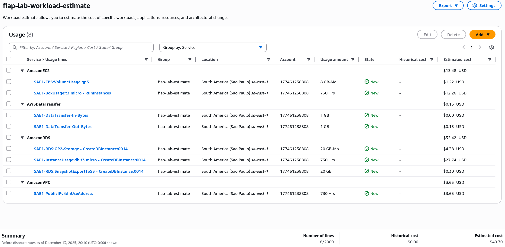
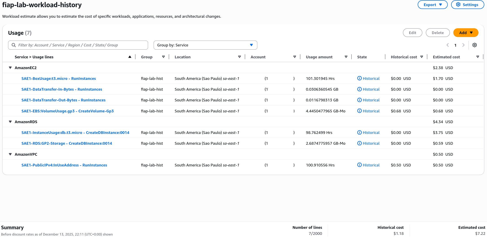

| [↩️ Back](/) |
| --- |

# TECH CHALLENGE Fase 1 - Custos

## 🧩 Componentes

O ambiente foi provisionado na AWS com o modelo de precificação "_on-demand_". Este modelo permite o uso de recursos sob demanda, o que pode ser favorável para usos esporádicos. Entretanto, esse modelo também pode ter um custo mais elevado, pois a previsão de uso geralmente é indeterminada.

Os principais componentes da AWS utilizados no ambiente são:

- ⚙️ **Aplicação geral:** EC2 `t3.micro`
- 💾 **Banco de Dados:** RDS PostgreSQL `db.t3.micro`

 

## 🖩 Calculadora de Preços AWS (_Pricing Calculator_)

A AWS fornece um ambiente de gerenciamento de custos e faturamento que inclui a ferramenta _Pricing Calculator_, que auxilia na estimativa de custos.

Para o ambiente da ToggleMaster, foram estimados valores mensais para novos serviços. Adicionalmente, a _Pricing Calculator_ também considerou o histórico de uso do ambiente e gerou uma segunda estimativa, conforme as planilhas a seguir.

 

### 💲 Estimativa para novos serviços

 

### 💲 Estimativa com histórico de uso

 

| [⬆️ Top](#tech-challenge---custos) |
| --- |