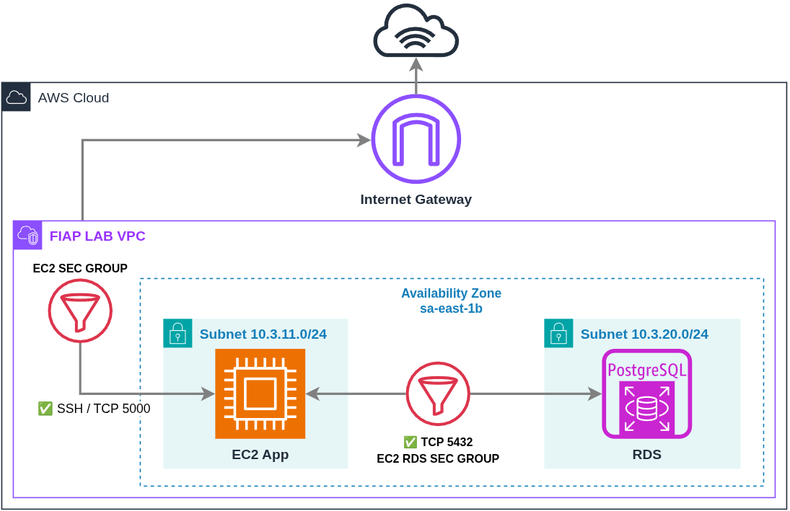
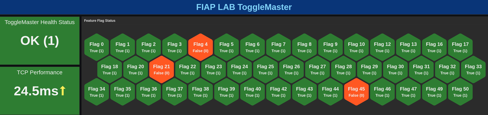

| [↩️ Back](/) |
| --- |

# TECH CHALLENGE - Diagrama

## Resumo descritivo

A aplicação é executada em um ambiente AWS, utilizando uma instância EC2 conectada a uma instância de banco de dados RDS. Ambas estão em uma VPC com duas sub-redes. A EC2 está em uma sub-rede com um _security group_ que permite o acesso público SSH e HTTP para conexões administrativas e de dados, respectivamente. Entre as duas sub-redes, há um segundo _security group_ filtrando o tráfego, de modo que o banco de dados RDS receba a comunicação somente da instância EC2. Esse arranjo permite que os componentes funcionem de forma integrada e segura.

- 1 VPC com sub-redes pública e privada;
- 1 instância EC2 na sub-rede pública para executar a aplicação principal;
- 1 instância RDS PostgreSQL na sub-rede privada para a persistências de dados;
- 1 Security Group permitindo tráfego SSH e HTTP para a instância EC2 com uma origem específica;
- 1 Security Group permitindo tráfego apenas do Security Group da EC2 em direção ao RDS.

> _Dashboard MVP de exemplo_

 

| [⬆️ Top](#tech-challenge---diagrama) |
| --- |